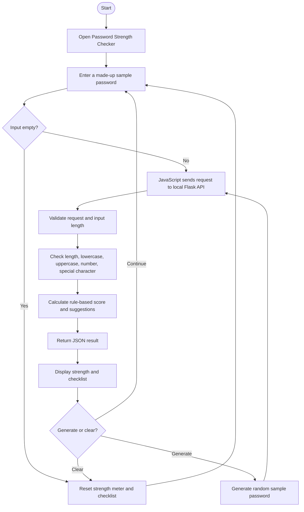

# Flowchart

## Architecture
Browser (HTML/CSS/JavaScript) → local HTTP POST request → Flask route `/api/check-password` → Python evaluation function → JSON response → browser updates the UI.

No database is used.
